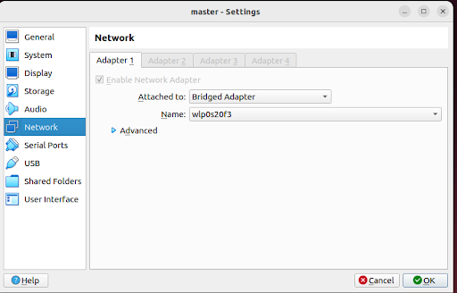
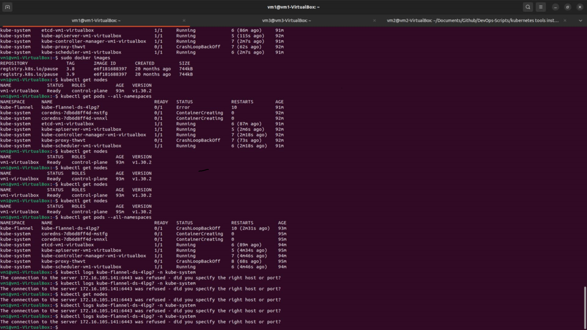
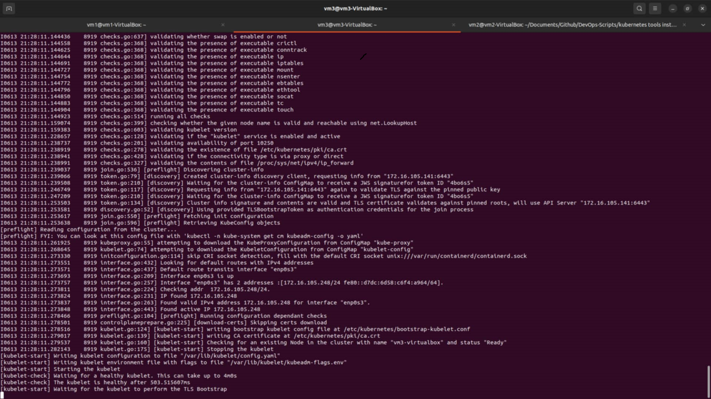
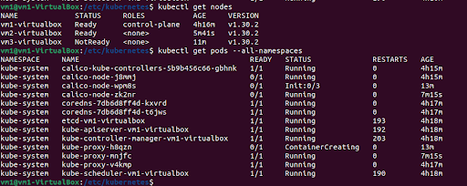

### Kubeadm Cluster: 

(VM Networking)

**Direct VM-to-VM Communication**:
In a Host-Only network, VMs can communicate directly with each other without any intermediate translation or routing. This direct communication is crucial for Kubernetes clusters, where the master node needs to communicate with worker nodes reliably.

_**Host-Only Network**_:
Direct IP communication between VMs. Only host adapter , Host network will not be accessed!!

_**NAT Network**_:
Typically isolates VMs from each other unless complex port forwarding rules are set up. (By using NAT network , Host network will be accessed , but For the outside world , all worker node’s ip will be same! In this case Kubeadm will not be working)

_**Bridge Adapter**_:
Without Bridge Adapter Kubernetes api server will not be found. So, just use Bridge!!!



Details: https://www.nakivo.com/blog/virtualbox-network-setting-guide/

### VM Setup

##### Installation :

1. ##### **Set Up Virtual Machines**
Create multiple VMs that will serve as your Kubernetes master and nodes.

**#Open VirtualBox/VMware:**

- Create a new VM for each node.
- Allocate resources (CPU, RAM, disk space) according to your needs.
- A minimal setup could be 2 -CPUs, 2GB RAM, and 20GB disk space per VM.
- Choose a Linux distribution (Ubuntu is commonly used) and install it on each VM.

**#Configure Network:**
Ensure all VMs are in the same network (Bridge Adapter)

2. ##### **Install Kubernetes Dependencies**

On each VM, 
**install Docker:**
```sh
sudo apt-get update
sudo apt-get install -y docker.io
sudo systemctl enable docker
sudo systemctl start docker
```
(Instead of Docker)

**install Containerd** and configure it on master node.
_https://www.itzgeek.com/how-tos/linux/ubuntu-how-tos/install-containerd-on-ubuntu-22-04.html_

First of all,  **disable swapoff** . Then install **kubeadm** 
```sh
sudo swapoff -a 
```
-Install kubeadm, kubelet, and kubectl
On each VM, install the necessary Kubernetes tools:

These instructions are for Kubernetes v1.30.
Update the apt package index and install packages needed to use the Kubernetes apt repository:
```sh
sudo apt-get update
# apt-transport-https may be a dummy package; if so, you can skip that package
sudo apt-get install -y apt-transport-https ca-certificates curl gpg
Download the public signing key for the Kubernetes package repositories. The same signing key is used for all repositories so you can disregard the version in the URL:
# If the directory `/etc/apt/keyrings` does not exist, it should be created before the curl command, read the note below.
# sudo mkdir -p -m 755 /etc/apt/keyrings
curl -fsSL https://pkgs.k8s.io/core:/stable:/v1.30/deb/Release.key | sudo gpg --dearmor -o /etc/apt/keyrings/kubernetes-apt-keyring.gpg
Add the appropriate Kubernetes apt repository. Please note that this repository have packages only for Kubernetes 1.30; for other Kubernetes minor versions, you need to change the Kubernetes minor version in the URL to match your desired minor version (you should also check that you are reading the documentation for the version of Kubernetes that you plan to install).
# This overwrites any existing configuration in /etc/apt/sources.list.d/kubernetes.list


echo 'deb [signed-by=/etc/apt/keyrings/kubernetes-apt-keyring.gpg] https://pkgs.k8s.io/core:/stable:/v1.30/deb/ /' | sudo tee /etc/apt/sources.list.d/kubernetes.list
Update the apt package index, install kubelet, kubeadm and kubectl, and pin their version:
sudo apt-get update


sudo apt-get install -y kubelet kubeadm kubectl
sudo apt-mark hold kubelet kubeadm kubectl


(Optional) Enable the kubelet service before running kubeadm:
sudo systemctl enable --now kubelet
```

 3. ##### **Initialize Kubernetes Master**

On the master VM:

3.1. **Initialize the master node**

(pod network CIDR defines the IP range for the pods that run on the nodes within the cluster)
```sh
sudo kubeadm init --pod-network-cidr=192.168.0.0/16
```

(**If sandbox image related issue occurred ->**)

**Sandbox Image (pause Image)**:
The sandbox image, often referred to as the pause container, is a small container image used by Kubernetes to manage the network namespace for a pod. This container runs a very lightweight process that essentially does nothing (pause), hence the name.
All other containers in the pod share the network namespace with the pause container, which means they all have the same IP address and can communicate with each other via localhost.

**Update the sandbox image :** 
**Pull the Recommended Sandbox Image:** 
```sh
sudo docker pull registry.k8s.io/pause:3.9
```

-Retag the Image to Match the One Currently Used:
```sh
sudo docker tag registry.k8s.io/pause:3.9 registry.k8s.io/pause:3.8
```
-Re-run kubeadm init:
```sh
 kubeadm join 172.16.105.223:6443 --token x8qn5r.2rr8zjh08k7k377a \
	--discovery-token-ca-cert-hash sha256:9a7c9925c4c231b5d8be3266c2d5cec56bb9363812086ce204c619923979eb7e 
```

3.2. **Set up local kubeconfig**
```sh
mkdir -p $HOME/.kube
sudo cp -i /etc/kubernetes/admin.conf $HOME/.kube/config
sudo chown $(id -u):$(id -g) $HOME/.kube/config
```


4. ##### **Install a Pod network plugin or add-on (e.g., Calico):**

```sh
kubectl apply -f https://calico-v3-25.netlify.app/archive/v3.25/manifests/calico.yaml
```


5. ##### **Join Nodes to the Cluster**

On each node VM:
Use the join command provided by the kubeadm init output on the master VM:
```sh
sudo kubeadm join <master-ip>:6443 --token <token> --discovery-token-ca-cert-hash sha256:<hash>
```
_Eg: kubeadm join 10.0.3.15:6443 --token yhx35m.6e63ir22ej59ceh7 \
	--discovery-token-ca-cert-hash sha256:5660e55bced4aa8ef4da8e6de3a4ec7898c8577c6c4068b7ae04d3fca7656e5d_
	
(token generated after initialize master node.) 


The kubeadm init command output includes the kubeadm join command needed to join the nodes. If you lose the command, you can **generate a new token** on the master:
```sh
kubeadm token create --print-join-command
```


6. ##### **Verify the Cluster**

On the master VM:
Check the status of nodes:
```sh
kubectl get nodes
```




7. ##### **Error solving:**

```sh
sudo kubeadm reset
sudo rm -rf /etc/kubernetes/manifests/*.yaml
```

-**Kube api server is not running**
```sh 
ls /etc/kubernetes/manifests/
sudo docker ps -a | grep kube-apiserver
```

-**Waiting for the kubelet to perform the TLS Bootstrap**



##### _**If join nodes to cluster is not working!!!**_
Follow these steps : 

_(**Worker Node**)_

1. Create a 20-etcd-service-manager.conf  file inside /etc/systemd/system/kubelet.service.d

```sh
[Service]
Environment="ETCD_NAME=$(hostname)"
```
2. Create a  10-kubeadm.conf file inside /etc/systemd/system/kubelet.service.d

```sh
[Unit]

Description=kubelet: The Kubernetes Node Agent
Documentation=https://kubernetes.io/docs/
After=network.target


[Service]

ExecStart=
ExecStart=/usr/bin/kubelet --bootstrap-kubeconfig=/etc/kubernetes/bootstrap-kubelet.conf --kubeconfig=/etc/kubernetes/kubelet.conf --config=/var/lib/kubelet/config.yaml --cgroup-driver=cgroupfs

Restart=always
StartLimitInterval=0
RestartSec=10


# Having non-zero Limit*s causes performance problems due to accounting overhead
# in the kernel. We recommend using cgroups to do container-local accounting.
LimitNOFILE=1048576
LimitNPROC=1048576
LimitCORE=infinity


# Comment this if you want to manually load kernel modules
Environment="KUBELET_KUBEADM_ARGS="
Environment="KUBELET_CONFIG_ARGS=--config=/var/lib/kubelet/config.yaml"
Environment="KUBELET_EXTRA_ARGS=--node-ip=172.16.105.248 --pod-infra-container-image=k8s.gcr.io/pause:3.5 --cgroup-driver=systemd"


[Install]
WantedBy=multi-user.target
```
3. At first **comment out** the line in 10-kubeadm.conf : 

```sh
ExecStart=
ExecStart=/usr/bin/kubelet --bootstrap-kubeconfig=/etc/kubernetes/bootstrap-kubelet.conf --kubeconfig=/etc/kubernetes/kubelet.conf --config=/var/lib/kubelet/config.yaml --cgroup-driver=cgroupfs
```
 & Stop the kubelet service. And execute command:
 ```sh
 systemctl daemon-reload
```
4. Now run kubeadm join (token) until the TLS Bootstrap log comes. When it comes then stop it. This way all your configuration files will be created.

5. Now comment out that line and again execute:

```sh
systemctl daemon-reload
sudo systemctl stop kubelet
```
6. Now execute command 

```sh
	systemctl daemon-reload
	sudo systemctl restart kubelet
```	
If any error then give permission:
```sh
	sudo chown -R root:root /etc/kubernetes/
	sudo chmod 755 /var/lib/kubelet/
	sudo chmod 666 /run/containerd/containerd.sock
	sudo systemctl restart docker
	sudo systemctl restart kubelet
```
7. Now run

```sh 
kubeadm  join with --skip-phases=preflight
```




